# 🗄️ Entity Relationship Diagram (ERD) & Database Specification
# Website Portofolio & Built-in CMS (Helmi Salsabila)

* **Dokumen:** Database Schema & ERD Architecture
* **Target Database:** MySQL 8.x / MariaDB 10.x (cPanel Native)
* **ORM:** Drizzle ORM (Type-Safe, Zero-Overhead)

---

## 1. Visual Entity Relationship Diagram (Mermaid)

Berikut adalah relasi lengkap antar entitas yang mendukung **100% fitur pada 7 halaman mockup** (Layanan & Galeri, Produk & List Materi Kurikulum, Artikel & Tags/Kategori, Testimoni Klien, Langkah Kerja, dan Pengaturan Situs).

```mermaid
erDiagram
    USERS ||--o{ ARTICLES : "writes"
    CATEGORIES ||--o{ SERVICES : "classifies"
    CATEGORIES ||--o{ PRODUCTS : "classifies"
    CATEGORIES ||--o{ ARTICLES : "classifies"
    
    SERVICES ||--o{ SERVICE_GALLERIES : "has multiple"
    
    PRODUCTS ||--o{ PRODUCT_GALLERIES : "has multiple"
    PRODUCTS ||--o{ PRODUCT_MODULES : "has curriculum"
    PRODUCT_MODULES ||--o{ PRODUCT_LESSONS : "contains"
    
    ARTICLES ||--o{ ARTICLE_TAGS : "tagged with"
    TAGS ||--o{ ARTICLE_TAGS : "assigned to"

    USERS {
        varchar(36) id PK "UUID"
        varchar(100) name
        varchar(255) email UK
        varchar(255) password_hash
        enum role "admin, editor"
        varchar(500) avatar_url
        timestamp created_at
        timestamp updated_at
    }

    CATEGORIES {
        varchar(36) id PK "UUID"
        varchar(100) name
        varchar(120) slug UK
        enum type "service, product, article, general"
        int order_index
        timestamp created_at
    }

    TAGS {
        varchar(36) id PK "UUID"
        varchar(100) name
        varchar(120) slug UK
        timestamp created_at
    }

    SERVICES {
        varchar(36) id PK "UUID"
        varchar(36) category_id FK
        varchar(200) title
        varchar(250) slug UK
        varchar(500) thumbnail_url
        varchar(100) icon_name "Lucide icon name"
        varchar(300) short_description
        longtext full_description "Rich content / markdown"
        json features "Checklist keunggulan [✓]"
        json tools_used "Python, Colab, etc"
        json outputs_received "File analysis, report, etc"
        json target_audience "Mahasiswa, UMKM, etc"
        decimal price_starting_at "12,2"
        boolean is_featured "Show on Homepage"
        boolean is_active "Status publish"
        int order_index
        int views_count
        timestamp created_at
        timestamp updated_at
    }

    SERVICE_GALLERIES {
        varchar(36) id PK "UUID"
        varchar(36) service_id FK
        varchar(500) image_url
        varchar(255) caption
        int order_index
        timestamp created_at
    }

    PRODUCTS {
        varchar(36) id PK "UUID"
        varchar(36) category_id FK
        varchar(200) title
        varchar(250) slug UK
        varchar(500) thumbnail_url "3D Cover Mockup"
        varchar(100) level_badge "Semua Level, Pemula, etc"
        decimal original_price "12,2"
        int discount_percent "e.g. 10%"
        decimal discounted_price "12,2"
        int total_sales "Counter terjual: 1.200"
        longtext about_product "Deskripsi lengkap"
        json what_you_get "Template, panduan, lifetime access"
        json suitable_for "Freelancer, jobseeker, etc"
        varchar(500) live_demo_url
        varchar(500) purchase_link_external
        boolean is_featured "Show on Homepage"
        boolean is_published
        int order_index
        timestamp created_at
        timestamp updated_at
    }

    PRODUCT_GALLERIES {
        varchar(36) id PK "UUID"
        varchar(36) product_id FK
        varchar(500) image_url
        int order_index
        timestamp created_at
    }

    PRODUCT_MODULES {
        varchar(36) id PK "UUID"
        varchar(36) product_id FK
        varchar(10) module_number "01, 02, 03"
        varchar(200) title "Personal Branding Fundamentals"
        int order_index
        timestamp created_at
    }

    PRODUCT_LESSONS {
        varchar(36) id PK "UUID"
        varchar(36) module_id FK
        varchar(255) title "Apa itu personal branding?"
        varchar(50) lesson_type "document, video, quiz"
        int order_index
        timestamp created_at
    }

    ARTICLES {
        varchar(36) id PK "UUID"
        varchar(36) author_id FK
        varchar(36) category_id FK
        varchar(255) title
        varchar(300) slug UK
        varchar(500) excerpt
        longtext content "TipTap HTML / Markdown"
        varchar(500) featured_image
        int reading_time_min "e.g. 3 min"
        int views_count "Counter sudah dibaca: 1000x"
        boolean is_popular "Top 2 Featured Hero Cards"
        boolean is_trending "Sidebar Trending badge"
        int trending_rank "1, 2, 3"
        boolean is_published
        timestamp published_at
        timestamp created_at
        timestamp updated_at
    }

    ARTICLE_TAGS {
        varchar(36) article_id PK,FK
        varchar(36) tag_id PK,FK
    }

    TESTIMONIALS {
        varchar(36) id PK "UUID"
        varchar(150) client_name "Regina"
        varchar(150) client_company "FOOM"
        varchar(500) avatar_url
        varchar(500) company_logo_url
        text quote "Nilai excellent untuk semuanya..."
        int rating "1 - 5"
        boolean is_active
        int order_index
        timestamp created_at
    }

    SITE_SETTINGS {
        int id PK "1"
        varchar(150) site_name
        varchar(255) hero_title
        text hero_subtitle
        text bio_description
        varchar(500) avatar_url
        varchar(500) resume_cv_url
        varchar(50) contact_phone "+6269233221"
        varchar(255) contact_address "Based in Tangerang, Indonesia"
        varchar(500) saweria_url
        json stats_counters "{ years: '5+', clients: '100+', projects: '100%' }"
        json social_links "{ linkedin, instagram, threads, youtube, facebook, tiktok }"
        varchar(255) meta_title
        varchar(500) meta_description
        varchar(500) og_image_url
        timestamp updated_at
    }

    WORK_STEPS {
        varchar(36) id PK "UUID"
        varchar(10) step_number "01, 02, 03, 04"
        varchar(200) title "Hubungi Saya & Sampaikan Kebutuhan"
        text description
        int order_index
        timestamp created_at
    }

    VALUE_PROPOSITIONS {
        varchar(36) id PK "UUID"
        varchar(150) title "Proses Aman & Terpercaya"
        text description
        varchar(100) icon_3d_name "padlock_shield, medal, money_bag, handshake"
        int order_index
        timestamp created_at
    }
```



---

## 2. Kamus Data (Data Dictionary) Lengkap

### 2.1 Tabel `users` (Admin & Author CMS)
| Kolom | Tipe Data | Nullable | Keterangan & Aturan |
| :--- | :--- | :---: | :--- |
| `id` | `VARCHAR(36)` | NO | Primary Key (UUID v4). |
| `name` | `VARCHAR(100)` | NO | Nama lengkap administrator / author ("Helmi Salsabila"). |
| `email` | `VARCHAR(255)` | NO | Email unik untuk login CMS. |
| `password_hash` | `VARCHAR(255)` | NO | Hash password menggunakan Bcrypt / Argon2id. |
| `role` | `ENUM('admin', 'editor')` | NO | Hak akses dashboard (Default: `'admin'`). |
| `avatar_url` | `VARCHAR(500)` | YES | URL foto avatar profil admin. |
| `created_at` | `TIMESTAMP` | NO | Waktu akun dibuat (`DEFAULT CURRENT_TIMESTAMP`). |
| `updated_at` | `TIMESTAMP` | NO | Waktu update terakhir. |

---

### 2.2 Tabel `categories` & `tags`
| Kolom | Tipe Data | Nullable | Keterangan & Aturan |
| :--- | :--- | :---: | :--- |
| **`categories.id`** | `VARCHAR(36)` | NO | Primary Key (UUID). |
| `name` | `VARCHAR(100)` | NO | Nama kategori (misal: "Data Analyst", "Technology", "IT Solution"). |
| `slug` | `VARCHAR(120)` | NO | URL-friendly slug unik (misal: `data-analyst`). |
| `type` | `ENUM(...)` | NO | Tipe entitas: `'service'`, `'product'`, `'article'`, `'general'`. |
| `order_index` | `INT` | NO | Urutan tampilan pada filter horizontal pills. |
| **`tags.id`** | `VARCHAR(36)` | NO | Primary Key (UUID). |
| `name` | `VARCHAR(100)` | NO | Nama tag (misal: "Information Technology", "Remote Working"). |
| `slug` | `VARCHAR(120)` | NO | Slug unik tag. |

---

### 2.3 Tabel `services` & `service_galleries` (Layanan & Portfolio)
Mendukung tampilan kartu layanan, halaman list layanan dengan filter, dan halaman **Detail Layanan**:

| Kolom | Tipe Data | Nullable | Keterangan & Aturan |
| :--- | :--- | :---: | :--- |
| `id` | `VARCHAR(36)` | NO | Primary Key (UUID). |
| `category_id` | `VARCHAR(36)` | YES | Foreign Key merujuk ke `categories.id`. |
| `title` | `VARCHAR(200)` | NO | Judul layanan (misal: *"Jasa Data Analyst (Python)"*). |
| `slug` | `VARCHAR(250)` | NO | URL unik slug (misal: `jasa-data-analyst-python`). |
| `thumbnail_url` | `VARCHAR(500)` | NO | Gambar cover utama card layanan. |
| `icon_name` | `VARCHAR(100)` | YES | Nama icon Lucide (misal: `database`, `bar-chart`). |
| `short_description`| `VARCHAR(300)` | NO | Deskripsi singkat pada kartu list. |
| `full_description` | `LONGTEXT` | NO | Rich text / HTML detail deskripsi layanan. |
| `features` | `JSON` | YES | Array teks keunggulan dengan checklist `✓`. |
| `tools_used` | `JSON` | YES | Array tools yang digunakan (e.g. `["Python", "Google Colab"]`). |
| `outputs_received`| `JSON` | YES | Array output deliverables (e.g. `["File Excel/CSV", "Grafik"]`). |
| `target_audience` | `JSON` | YES | Array sasaran (e.g. `["Mahasiswa", "UMKM", "Startup"]`). |
| `price_starting_at`| `DECIMAL(12,2)`| YES | Harga mulai (e.g. `200000.00` -> Rp200.000). |
| `is_featured` | `BOOLEAN` | NO | Tampilkan di Section Layanan Homepage (Default: `false`). |
| `is_active` | `BOOLEAN` | NO | Status publish (Default: `true`). |
| `order_index` | `INT` | NO | Urutan pengurutan card. |
| `views_count` | `INT` | NO | Akumulasi total views. |

#### Tabel `service_galleries` (Galeri Showcase Detail Layanan):
* `id` (`VARCHAR(36)`, PK)
* `service_id` (`VARCHAR(36)`, FK -> `services.id` ON DELETE CASCADE)
* `image_url` (`VARCHAR(500)`)
* `caption` (`VARCHAR(255)`)
* `order_index` (`INT`, default `0`) — *Mendukung tampilan 1 foto besar + 4 thumbnail kecil dengan overlay "+5 Gambar"*.

---

### 2.4 Tabel `products`, `product_modules`, & `product_lessons` (Produk Digital)
Mendukung tampilan list produk (mockup 3D, diskon, terjual) dan halaman **Detail Produk & List Materi Kurikulum**:

| Kolom | Tipe Data | Nullable | Keterangan & Aturan |
| :--- | :--- | :---: | :--- |
| `id` | `VARCHAR(36)` | NO | Primary Key (UUID). |
| `category_id` | `VARCHAR(36)` | YES | FK ke `categories.id`. |
| `title` | `VARCHAR(200)` | NO | Judul produk (misal: `[LIFETIME ACCESS] - PERSONAL BRANDING BUILDER`). |
| `slug` | `VARCHAR(250)` | NO | Slug unik. |
| `thumbnail_url` | `VARCHAR(500)` | NO | Gambar 3D Book Cover / Digital Mockup. |
| `level_badge` | `VARCHAR(100)` | NO | Badge level (misal: *"Semua Level"*, *"Pemula"*). |
| `original_price` | `DECIMAL(12,2)`| NO | Harga normal coret (misal: `350000.00` -> Rp350.000). |
| `discount_percent`| `INT` | NO | Persentase diskon (misal: `10` -> "Diskon 10%"). |
| `discounted_price`| `DECIMAL(12,2)`| NO | Harga akhir berbayar (misal: `200000.00` -> Rp200.000). |
| `total_sales` | `INT` | NO | Counter stat terjual (misal: `1200` -> "Terjual : 1.200"). |
| `about_product` | `LONGTEXT` | NO | Penjelasan lengkap produk digital. |
| `what_you_get` | `JSON` | YES | Array poin yang didapatkan pembeli. |
| `suitable_for` | `JSON` | YES | Array target pembeli (*Freelancer, Job Seeker, dll*). |
| `live_demo_url` | `VARCHAR(500)` | YES | Link preview eksternal jika ada. |
| `purchase_link_external` | `VARCHAR(500)` | YES | Link checkout/WhatsApp order. |
| `is_featured` | `BOOLEAN` | NO | Tampilkan di Homepage. |
| `is_published` | `BOOLEAN` | NO | Status publish. |

#### Tabel `product_modules` (Bab Kurikulum / List Materi):
* `id` (`VARCHAR(36)`, PK)
* `product_id` (`VARCHAR(36)`, FK -> `products.id` ON DELETE CASCADE)
* `module_number` (`VARCHAR(10)`) — Format nomor bab (misal: `"01"`, `"02"`, `"03"`).
* `title` (`VARCHAR(200)`) — Judul bab (misal: *"Personal Branding Fundamentals"*).
* `order_index` (`INT`)

#### Tabel `product_lessons` (Sub-Materi per Bab):
* `id` (`VARCHAR(36)`, PK)
* `module_id` (`VARCHAR(36)`, FK -> `product_modules.id` ON DELETE CASCADE)
* `title` (`VARCHAR(255)`) — Judul materi (misal: *"Apa itu personal branding?"*).
* `lesson_type` (`VARCHAR(50)`) — Default `'document'` (icon `📄`).
* `order_index` (`INT`)

---

### 2.5 Tabel `articles` & `article_tags` (Blog & Artikel)
Mendukung halaman blog, top 2 artikel populer besar, filter kategori, sidebar trending #1 #2 #3, dan **Detail Artikel**:

| Kolom | Tipe Data | Nullable | Keterangan & Aturan |
| :--- | :--- | :---: | :--- |
| `id` | `VARCHAR(36)` | NO | Primary Key (UUID). |
| `author_id` | `VARCHAR(36)` | NO | FK ke `users.id` (Author "Helmi Salsabila"). |
| `category_id` | `VARCHAR(36)` | YES | FK ke `categories.id`. |
| `title` | `VARCHAR(255)` | NO | Judul artikel (misal: *"3 Headphone JBL Terbaik 2026..."*). |
| `slug` | `VARCHAR(300)` | NO | Slug artikel unik. |
| `excerpt` | `VARCHAR(500)` | NO | Ringkasan untuk meta description & kartu preview. |
| `content` | `LONGTEXT` | NO | Isi artikel dalam format TipTap HTML / Markdown dengan heading otomatis terdeteksi TOC. |
| `featured_image` | `VARCHAR(500)` | NO | Gambar banner utama artikel. |
| `reading_time_min`| `INT` | NO | Estimasi menit baca (misal: `3` -> "3 min read"). |
| `views_count` | `INT` | NO | Counter total dibaca (misal: `1000` -> "Sudah Dibaca 1000x"). |
| `is_popular` | `BOOLEAN` | NO | Status untuk tampil di **Top 2 Hero Banner Artikel Populer**. |
| `is_trending` | `BOOLEAN` | NO | Status untuk tampil di **Sidebar Trending List**. |
| `trending_rank` | `INT` | YES | Urutan trending (`1` -> TRENDING #1, `2` -> TRENDING #2, `3` -> TRENDING #3). |
| `is_published` | `BOOLEAN` | NO | Status publikasi. |
| `published_at` | `TIMESTAMP` | YES | Tanggal rilis artikel (misal: "3 Agustus 2026, 19:26 WIB"). |

---

### 2.6 Tabel Pendukung Landing Page (Testimoni, Alur Kerja, Why Us, Settings)

#### A. Tabel `testimonials` (Testimoni Klien)
* `id` (`VARCHAR(36)`, PK)
* `client_name` (`VARCHAR(150)`) — Misal: *"Regina"*
* `client_company` (`VARCHAR(150)`) — Misal: *"FOOM"*
* `avatar_url` (`VARCHAR(500)`) — Foto avatar klien
* `company_logo_url` (`VARCHAR(500)`) — Logo brand klien (misal logo FOOM)
* `quote` (`TEXT`) — Isi testimoni klien
* `rating` (`INT`, default: `5`)
* `is_active` (`BOOLEAN`, default: `true`)
* `order_index` (`INT`)

#### B. Tabel `work_steps` (Alur Kerjasama 01 s/d 04)
* `id` (`VARCHAR(36)`, PK)
* `step_number` (`VARCHAR(10)`) — `"01"`, `"02"`, `"03"`, `"04"`
* `title` (`VARCHAR(200)`) — Misal: *"Hubungi Saya dan Sampaikan Kebutuhan"*
* `description` (`TEXT`) — Penjelasan langkah kerja
* `order_index` (`INT`)

#### C. Tabel `value_propositions` (Kenapa Memilih Layanan Saya)
* `id` (`VARCHAR(36)`, PK)
* `title` (`VARCHAR(150)`) — *"Proses Aman & Terpercaya"*, *"Kualitas Hasil Terbaik"*, *"Harga Terjangkau"*, *"Dipercaya Banyak Client"*
* `description` (`TEXT`)
* `icon_3d_name` (`VARCHAR(100)`) — Identifikasi aset icon 3D Claymorphism
* `order_index` (`INT`)

#### D. Tabel `site_settings` (Konfigurasi Global & Saweria)
* `id` (`INT`, PK, default: `1`) — Single Row Configuration
* `site_name` (`VARCHAR(150)`) — *"Helmi Salsabila"*
* `hero_title` (`VARCHAR(255)`) — *"Your Reliable Partner for Data & Digital Solutions."*
* `hero_subtitle` (`TEXT`) — *"Masalah ditemukan. Solusi diarahkan. Pilihan terbaik direkomendasikan."*
* `bio_description` (`TEXT`)
* `avatar_url` (`VARCHAR(500)`)
* `resume_cv_url` (`VARCHAR(500)`)
* `contact_phone` (`VARCHAR(50)`) — `"+6269233221"`
* `contact_address` (`VARCHAR(255)`) — `"Based in Tangerang, Indonesia"`
* `saweria_url` (`VARCHAR(500)`) — Link donasi Saweria untuk widget detail artikel
* `stats_counters` (`JSON`) — `{ "years": "5+", "clients": "100+", "projects": "100%" }`
* `social_links` (`JSON`) — `{ "linkedin": "...", "instagram": "...", "threads": "...", "youtube": "...", "facebook": "...", "tiktok": "..." }`
* `meta_title`, `meta_description`, `og_image_url`

---

## 3. Relasi & Integritas Data (Foreign Keys & Indexes)

### 3.1 Foreign Key Cascade Rules
1. `service_galleries.service_id` -> `services.id` (**ON DELETE CASCADE**)
2. `product_galleries.product_id` -> `products.id` (**ON DELETE CASCADE**)
3. `product_modules.product_id` -> `products.id` (**ON DELETE CASCADE**)
4. `product_lessons.module_id` -> `product_modules.id` (**ON DELETE CASCADE**)
5. `articles.author_id` -> `users.id` (**ON DELETE RESTRICT**)
6. `article_tags.article_id` -> `articles.id` (**ON DELETE CASCADE**)
7. `article_tags.tag_id` -> `tags.id` (**ON DELETE CASCADE**)

### 3.2 Indeks Kinerja Database (Optimasi Shared Hosting cPanel)
Untuk memastikan query pencarian instan dan meminimalkan beban CPU hosting:
* `CREATE UNIQUE INDEX idx_services_slug ON services(slug);`
* `CREATE UNIQUE INDEX idx_products_slug ON products(slug);`
* `CREATE UNIQUE INDEX idx_articles_slug ON articles(slug);`
* `CREATE INDEX idx_articles_published ON articles(is_published, published_at DESC);`
* `CREATE INDEX idx_articles_popular ON articles(is_popular, is_published);`
* `CREATE INDEX idx_articles_trending ON articles(is_trending, trending_rank);`
* `CREATE INDEX idx_products_filter ON products(category_id, is_published, discounted_price);`
* `CREATE INDEX idx_services_filter ON services(category_id, is_active, price_starting_at);`

---

## 4. Drizzle ORM Schema Implementation Code (`src/db/schema.ts`)

```typescript
import {
  mysqlTable,
  varchar,
  text,
  longtext,
  int,
  decimal,
  boolean,
  timestamp,
  mysqlEnum,
  json,
  primaryKey,
} from 'drizzle-orm/mysql-core';
import { relations } from 'drizzle-orm';

// 1. Users
export const users = mysqlTable('users', {
  id: varchar('id', { length: 36 }).primaryKey(),
  name: varchar('name', { length: 100 }).notNull(),
  email: varchar('email', { length: 255 }).notNull().unique(),
  passwordHash: varchar('password_hash', { length: 255 }).notNull(),
  role: mysqlEnum('role', ['admin', 'editor']).default('admin').notNull(),
  avatarUrl: varchar('avatar_url', { length: 500 }),
  createdAt: timestamp('created_at').defaultNow().notNull(),
  updatedAt: timestamp('updated_at').defaultNow().onUpdateNow().notNull(),
});

// 2. Categories
export const categories = mysqlTable('categories', {
  id: varchar('id', { length: 36 }).primaryKey(),
  name: varchar('name', { length: 100 }).notNull(),
  slug: varchar('slug', { length: 120 }).notNull().unique(),
  type: mysqlEnum('type', ['service', 'product', 'article', 'general']).default('general').notNull(),
  orderIndex: int('order_index').default(0).notNull(),
  createdAt: timestamp('created_at').defaultNow().notNull(),
});

// 3. Tags
export const tags = mysqlTable('tags', {
  id: varchar('id', { length: 36 }).primaryKey(),
  name: varchar('name', { length: 100 }).notNull(),
  slug: varchar('slug', { length: 120 }).notNull().unique(),
  createdAt: timestamp('created_at').defaultNow().notNull(),
});

// 4. Services
export const services = mysqlTable('services', {
  id: varchar('id', { length: 36 }).primaryKey(),
  categoryId: varchar('category_id', { length: 36 }).references(() => categories.id, { onDelete: 'set null' }),
  title: varchar('title', { length: 200 }).notNull(),
  slug: varchar('slug', { length: 250 }).notNull().unique(),
  thumbnailUrl: varchar('thumbnail_url', { length: 500 }).notNull(),
  iconName: varchar('icon_name', { length: 100 }),
  shortDescription: varchar('short_description', { length: 300 }).notNull(),
  fullDescription: longtext('full_description').notNull(),
  features: json('features').$type<string[]>(),
  toolsUsed: json('tools_used').$type<string[]>(),
  outputsReceived: json('outputs_received').$type<string[]>(),
  targetAudience: json('target_audience').$type<string[]>(),
  priceStartingAt: decimal('price_starting_at', { precision: 12, scale: 2 }),
  isFeatured: boolean('is_featured').default(false).notNull(),
  isActive: boolean('is_active').default(true).notNull(),
  orderIndex: int('order_index').default(0).notNull(),
  viewsCount: int('views_count').default(0).notNull(),
  createdAt: timestamp('created_at').defaultNow().notNull(),
  updatedAt: timestamp('updated_at').defaultNow().onUpdateNow().notNull(),
});

export const serviceGalleries = mysqlTable('service_galleries', {
  id: varchar('id', { length: 36 }).primaryKey(),
  serviceId: varchar('service_id', { length: 36 }).notNull().references(() => services.id, { onDelete: 'cascade' }),
  imageUrl: varchar('image_url', { length: 500 }).notNull(),
  caption: varchar('caption', { length: 255 }),
  orderIndex: int('order_index').default(0).notNull(),
  createdAt: timestamp('created_at').defaultNow().notNull(),
});

// 5. Products
export const products = mysqlTable('products', {
  id: varchar('id', { length: 36 }).primaryKey(),
  categoryId: varchar('category_id', { length: 36 }).references(() => categories.id, { onDelete: 'set null' }),
  title: varchar('title', { length: 200 }).notNull(),
  slug: varchar('slug', { length: 250 }).notNull().unique(),
  thumbnailUrl: varchar('thumbnail_url', { length: 500 }).notNull(),
  levelBadge: varchar('level_badge', { length: 100 }).default('Semua Level').notNull(),
  originalPrice: decimal('original_price', { precision: 12, scale: 2 }).notNull(),
  discountPercent: int('discount_percent').default(0).notNull(),
  discountedPrice: decimal('discounted_price', { precision: 12, scale: 2 }).notNull(),
  totalSales: int('total_sales').default(0).notNull(),
  aboutProduct: longtext('about_product').notNull(),
  whatYouGet: json('what_you_get').$type<string[]>(),
  suitableFor: json('suitable_for').$type<string[]>(),
  liveDemoUrl: varchar('live_demo_url', { length: 500 }),
  purchaseLinkExternal: varchar('purchase_link_external', { length: 500 }),
  isFeatured: boolean('is_featured').default(false).notNull(),
  isPublished: boolean('is_published').default(true).notNull(),
  orderIndex: int('order_index').default(0).notNull(),
  createdAt: timestamp('created_at').defaultNow().notNull(),
  updatedAt: timestamp('updated_at').defaultNow().onUpdateNow().notNull(),
});

export const productGalleries = mysqlTable('product_galleries', {
  id: varchar('id', { length: 36 }).primaryKey(),
  productId: varchar('product_id', { length: 36 }).notNull().references(() => products.id, { onDelete: 'cascade' }),
  imageUrl: varchar('image_url', { length: 500 }).notNull(),
  orderIndex: int('order_index').default(0).notNull(),
  createdAt: timestamp('created_at').defaultNow().notNull(),
});

export const productModules = mysqlTable('product_modules', {
  id: varchar('id', { length: 36 }).primaryKey(),
  productId: varchar('product_id', { length: 36 }).notNull().references(() => products.id, { onDelete: 'cascade' }),
  moduleNumber: varchar('module_number', { length: 10 }).notNull(), // "01", "02"
  title: varchar('title', { length: 200 }).notNull(),
  orderIndex: int('order_index').default(0).notNull(),
  createdAt: timestamp('created_at').defaultNow().notNull(),
});

export const productLessons = mysqlTable('product_lessons', {
  id: varchar('id', { length: 36 }).primaryKey(),
  moduleId: varchar('module_id', { length: 36 }).notNull().references(() => productModules.id, { onDelete: 'cascade' }),
  title: varchar('title', { length: 255 }).notNull(),
  lessonType: varchar('lesson_type', { length: 50 }).default('document').notNull(),
  orderIndex: int('order_index').default(0).notNull(),
  createdAt: timestamp('created_at').defaultNow().notNull(),
});

// 6. Articles
export const articles = mysqlTable('articles', {
  id: varchar('id', { length: 36 }).primaryKey(),
  authorId: varchar('author_id', { length: 36 }).notNull().references(() => users.id, { onDelete: 'restrict' }),
  categoryId: varchar('category_id', { length: 36 }).references(() => categories.id, { onDelete: 'set null' }),
  title: varchar('title', { length: 255 }).notNull(),
  slug: varchar('slug', { length: 300 }).notNull().unique(),
  excerpt: varchar('excerpt', { length: 500 }).notNull(),
  content: longtext('content').notNull(),
  featuredImage: varchar('featured_image', { length: 500 }).notNull(),
  readingTimeMin: int('reading_time_min').default(3).notNull(),
  viewsCount: int('views_count').default(0).notNull(),
  isPopular: boolean('is_popular').default(false).notNull(),
  isTrending: boolean('is_trending').default(false).notNull(),
  trendingRank: int('trending_rank'),
  isPublished: boolean('is_published').default(false).notNull(),
  publishedAt: timestamp('published_at'),
  createdAt: timestamp('created_at').defaultNow().notNull(),
  updatedAt: timestamp('updated_at').defaultNow().onUpdateNow().notNull(),
});

export const articleTags = mysqlTable('article_tags', {
  articleId: varchar('article_id', { length: 36 }).notNull().references(() => articles.id, { onDelete: 'cascade' }),
  tagId: varchar('tag_id', { length: 36 }).notNull().references(() => tags.id, { onDelete: 'cascade' }),
}, (t) => ({
  pk: primaryKey({ columns: [t.articleId, t.tagId] }),
}));

// 7. Testimonials
export const testimonials = mysqlTable('testimonials', {
  id: varchar('id', { length: 36 }).primaryKey(),
  clientName: varchar('client_name', { length: 150 }).notNull(),
  clientCompany: varchar('client_company', { length: 150 }).notNull(),
  avatarUrl: varchar('avatar_url', { length: 500 }),
  companyLogoUrl: varchar('company_logo_url', { length: 500 }),
  quote: text('quote').notNull(),
  rating: int('rating').default(5).notNull(),
  isActive: boolean('is_active').default(true).notNull(),
  orderIndex: int('order_index').default(0).notNull(),
  createdAt: timestamp('created_at').defaultNow().notNull(),
});

// 8. Site Settings & Landing Page Elements
export const siteSettings = mysqlTable('site_settings', {
  id: int('id').primaryKey().default(1),
  siteName: varchar('site_name', { length: 150 }).notNull(),
  heroTitle: varchar('hero_title', { length: 255 }).notNull(),
  heroSubtitle: text('hero_subtitle').notNull(),
  bioDescription: text('bio_description').notNull(),
  avatarUrl: varchar('avatar_url', { length: 500 }),
  resumeCvUrl: varchar('resume_cv_url', { length: 500 }),
  contactPhone: varchar('contact_phone', { length: 50 }).notNull(),
  contactAddress: varchar('contact_address', { length: 255 }).notNull(),
  saweriaUrl: varchar('saweria_url', { length: 500 }),
  statsCounters: json('stats_counters').$type<{ years: string; clients: string; projects: string }>(),
  socialLinks: json('social_links').$type<{
    linkedin?: string;
    instagram?: string;
    threads?: string;
    youtube?: string;
    facebook?: string;
    tiktok?: string;
  }>(),
  metaTitle: varchar('meta_title', { length: 255 }),
  metaDescription: varchar('meta_description', { length: 500 }),
  ogImageUrl: varchar('og_image_url', { length: 500 }),
  updatedAt: timestamp('updated_at').defaultNow().onUpdateNow().notNull(),
});

export const workSteps = mysqlTable('work_steps', {
  id: varchar('id', { length: 36 }).primaryKey(),
  stepNumber: varchar('step_number', { length: 10 }).notNull(), // "01", "02", "03", "04"
  title: varchar('title', { length: 200 }).notNull(),
  description: text('description').notNull(),
  orderIndex: int('order_index').default(0).notNull(),
  createdAt: timestamp('created_at').defaultNow().notNull(),
});

export const valuePropositions = mysqlTable('value_propositions', {
  id: varchar('id', { length: 36 }).primaryKey(),
  title: varchar('title', { length: 150 }).notNull(),
  description: text('description').notNull(),
  icon3dName: varchar('icon_3d_name', { length: 100 }).notNull(),
  orderIndex: int('order_index').default(0).notNull(),
  createdAt: timestamp('created_at').defaultNow().notNull(),
});
```
