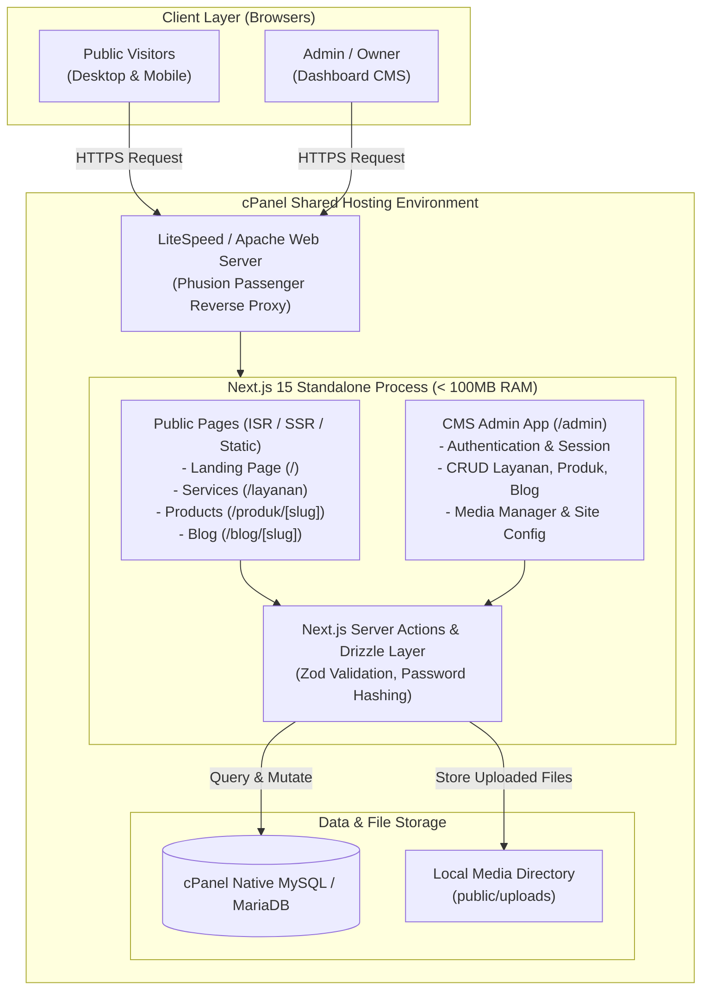
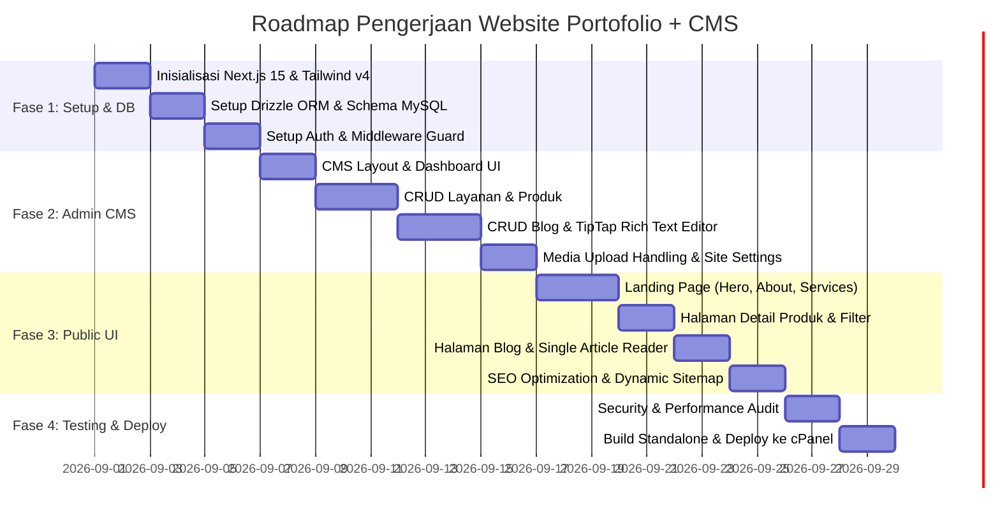

# Product Requirements Document (PRD)
# Website Portofolio & Built-in CMS (Next.js Latest Version)

* **Document Version:** 1.0.0
* **Status:** Draft / Ready for Review
* **Target Environment:** cPanel Shared Hosting (Phusion Passenger / Setup Node.js App)
* **Core Framework:** Next.js (App Router, Latest Version)

---

## 1. Executive Summary & Objective

### 1.1 Overview
Proyek ini bertujuan untuk membangun website portofolio profesional berkinerja tinggi yang dilengkapi dengan **Custom Built-in CMS (Admin Dashboard)**. Pemilik website dapat secara mandiri mengelola konten:
1. **Layanan (*Services*)**
2. **Produk & Karya (*Products / Portfolio Projects*)**
3. **Blog & Artikel (*Blog / Articles*)**
4. **Pengaturan Identitas & Kontak (*Site Settings*)**

### 1.2 Constraint & Solusi Deployment cPanel Shared Hosting
* **Tantangan Shared Hosting:** Alokasi RAM terbatas (512MB – 1GB LVE Limit CloudLinux) dan ketiadaan akses containerization (Docker).
* **Solusi Arsitektur:** 
  * Menghindari *Heavy Headless CMS* terpisah (seperti Strapi/Directus) yang memakan RAM >1GB.
  * Menggunakan **Next.js Standalone Mode + Server Actions + Drizzle ORM + cPanel Native MySQL/MariaDB**.
  * Semua sistem (Frontend, Backend API, Admin CMS, Database Connection) berjalan dalam **1 proses Node.js super ringan** dengan konsumsi RAM di bawah 80MB–120MB.

---

## 2. Tech Stack Specification

Semua teknologi menggunakan versi stabil terbaru (*latest versions*):

| Komponen | Pilihan Teknologi | Versi | Justifikasi & Performa |
| :--- | :--- | :--- | :--- |
| **Framework** | **Next.js (App Router)** | `v15.x` | Server Components (RSC), Incremental Static Regeneration (ISR), Server Actions, output standalone. |
| **Language** | **TypeScript** | `v5.x` | Type safety end-to-end dari database schema ke UI components. |
| **UI & Styling** | **Tailwind CSS + Lucide Icons** | `v4.x` | Utility-first, zero runtime CSS, bundle size sangat minimalis. |
| **UI Primitives** | **Radix UI / Shadcn UI components** | Latest | Komponen headless yang accessible, customizable, dan modern. |
| **Backend & API** | **Next.js Server Actions & Route Handlers** | Native Next.js | Tanpa service backend terpisah, zero CORS issue, hemat resource hosting. |
| **Database ORM** | **Drizzle ORM + Drizzle Kit** | `v0.38+` | Jauh lebih cepat dan ringan dibanding Prisma (tanpa binary engine Rust 40MB+ yang memakan RAM). |
| **Database Engine** | **MySQL / MariaDB (cPanel Native)** | Latest cPanel | Menggunakan database bawaan cPanel yang dikelola via phpMyAdmin (tanpa biaya tambahan). |
| **Authentication** | **Auth.js / Jose (JWT Cookie Session)** | Latest | Autentikasi berbasis HTTP-only cookies yang aman, stateless, dan ringan. |
| **Rich Text Editor** | **TipTap Editor / MDX** | Latest | Editor WYSIWYG modular untuk penulisan artikel blog yang bersih dan responsif. |
| **Image Handling** | **Sharp + WebP optimization** | Latest | Optimasi gambar otomatis saat build/runtime untuk Core Web Vitals. |

---

## 3. System Architecture & Data Flow



---

## 4. Database Schema & Data Models

Database dirancang secara relasional dan dinormalisasi menggunakan Drizzle ORM:

### 4.1 Schema Drizzle (`schema.ts`)

```typescript
// 1. USERS TABLE (Admin CMS)
export const users = mysqlTable('users', {
  id: varchar('id', { length: 36 }).primaryKey(), // UUID
  name: varchar('name', { length: 100 }).notNull(),
  email: varchar('email', { length: 255 }).notNull().unique(),
  password: varchar('password', { length: 255 }).notNull(), // Bcrypt hash
  role: mysqlEnum('role', ['admin', 'editor']).default('admin').notNull(),
  createdAt: timestamp('created_at').defaultNow().notNull(),
  updatedAt: timestamp('updated_at').defaultNow().onUpdateNow().notNull(),
});

// 2. SERVICES TABLE (Layanan)
export const services = mysqlTable('services', {
  id: varchar('id', { length: 36 }).primaryKey(),
  title: varchar('title', { length: 150 }).notNull(),
  slug: varchar('slug', { length: 180 }).notNull().unique(),
  icon: varchar('icon', { length: 50 }).notNull(), // Lucide icon name or SVG path
  shortDescription: varchar('short_description', { length: 255 }).notNull(),
  fullDescription: text('full_description').notNull(),
  features: json('features').$type<string[]>(), // Array of feature bullets
  priceStartingAt: int('price_starting_at'),
  orderIndex: int('order_index').default(0).notNull(),
  isActive: boolean('is_active').default(true).notNull(),
  createdAt: timestamp('created_at').defaultNow().notNull(),
  updatedAt: timestamp('updated_at').defaultNow().onUpdateNow().notNull(),
});

// 3. PRODUCTS TABLE (Produk / Portofolio Project)
export const products = mysqlTable('products', {
  id: varchar('id', { length: 36 }).primaryKey(),
  title: varchar('title', { length: 150 }).notNull(),
  slug: varchar('slug', { length: 180 }).notNull().unique(),
  category: varchar('category', { length: 100 }).notNull(), // e.g. "Web App", "UI/UX", "Mobile"
  shortDescription: varchar('short_description', { length: 255 }).notNull(),
  content: text('content').notNull(),
  thumbnailUrl: varchar('thumbnail_url', { length: 500 }).notNull(),
  galleryImages: json('gallery_images').$type<string[]>(),
  techStack: json('tech_stack').$type<string[]>(), // e.g. ["Next.js", "TypeScript", "Tailwind"]
  liveUrl: varchar('live_url', { length: 500 }),
  githubUrl: varchar('github_url', { length: 500 }),
  isFeatured: boolean('is_featured').default(false).notNull(),
  isPublished: boolean('is_published').default(true).notNull(),
  orderIndex: int('order_index').default(0).notNull(),
  createdAt: timestamp('created_at').defaultNow().notNull(),
  updatedAt: timestamp('updated_at').defaultNow().onUpdateNow().notNull(),
});

// 4. ARTICLES TABLE (Blog / Artikel)
export const articles = mysqlTable('articles', {
  id: varchar('id', { length: 36 }).primaryKey(),
  title: varchar('title', { length: 200 }).notNull(),
  slug: varchar('slug', { length: 250 }).notNull().unique(),
  excerpt: varchar('excerpt', { length: 300 }).notNull(),
  content: text('content').notNull(), // TipTap HTML or Markdown
  featuredImage: varchar('featured_image', { length: 500 }).notNull(),
  category: varchar('category', { length: 100 }).notNull(),
  tags: json('tags').$type<string[]>(),
  viewsCount: int('views_count').default(0).notNull(),
  readingTimeMin: int('reading_time_min').default(3).notNull(),
  isPublished: boolean('is_published').default(false).notNull(),
  publishedAt: timestamp('published_at'),
  authorId: varchar('author_id', { length: 36 }).references(() => users.id),
  createdAt: timestamp('created_at').defaultNow().notNull(),
  updatedAt: timestamp('updated_at').defaultNow().onUpdateNow().notNull(),
});

// 5. SITE SETTINGS TABLE (Profil & SEO Global)
export const siteSettings = mysqlTable('site_settings', {
  id: int('id').primaryKey().autoincrement(),
  siteName: varchar('site_name', { length: 100 }).notNull(),
  heroTitle: varchar('hero_title', { length: 200 }).notNull(),
  heroSubtitle: text('hero_subtitle').notNull(),
  bio: text('bio').notNull(),
  avatarUrl: varchar('avatar_url', { length: 500 }),
  resumeUrl: varchar('resume_url', { length: 500 }),
  socialLinks: json('social_links').$type<{
    github?: string;
    linkedin?: string;
    instagram?: string;
    whatsapp?: string;
    email?: string;
  }>(),
  metaTitle: varchar('meta_title', { length: 150 }),
  metaDescription: varchar('meta_description', { length: 255 }),
  ogImageUrl: varchar('og_image_url', { length: 500 }),
  updatedAt: timestamp('updated_at').defaultNow().onUpdateNow().notNull(),
});
```

---

## 5. Functional Requirements & Feature Matrix

### 5.1 Public Portfolio Features (Pengunjung)
1. **Hero & Intro Section:**
   * Headline dinamis dari database `siteSettings`.
   * Avatar / foto profil personal.
   * Call to Action (CTA): Unduh CV, Tombol Kontak WhatsApp / Email.
   * Badge status availability (contoh: *"Available for Freelance Projects"*).
2. **Services Showcase (`/layanan` & Homepage Section):**
   * Grid kartu layanan interaktif dengan ikon dinamis (Lucide).
   * Menampilkan ringkasan fitur tiap layanan dan estimasi harga awal.
3. **Products & Portfolio Showcase (`/produk` & `/produk/[slug]`):**
   * Filter kategori karya (Web App, Mobile, Design, dll).
   * Halaman detail proyek: Screenshot gallery viewer, deskripsi studi kasus, badges tech stack, tombol Live Preview dan Source Code GitHub.
4. **Blog & Articles Section (`/blog` & `/blog/[slug]`):**
   * Pencarian artikel real-time berdasarkan judul / tag.
   * Format bacaan rapi (*Typography Prose*), estimasi waktu baca, tanggal rilis, dan syntax highlighter untuk code snippets.
   * Share buttons (Twitter/X, LinkedIn, WhatsApp).
5. **Contact & Socials:**
   * Form pesan langsung yang tervalidasi Zod.
   * Link terintegrasi ke seluruh media sosial aktif.
6. **SEO & Performance:**
   * Auto-generated OpenGraph meta tags untuk setiap artikel dan produk.
   * Dynamic XML Sitemap (`/sitemap.xml`) dan `robots.txt`.

### 5.2 Admin CMS Features (`/admin`)
1. **Authentication & Security:**
   * Halaman login `/admin/login` terproteksi dengan password hashing (Bcrypt).
   * HTTP-only cookies session (JWT) dengan proteksi CSRF.
   * Middleware route guard untuk mencegah akses non-admin.
2. **Dashboard Analytics:**
   * Counter total Layanan aktif, Total Produk, Total Artikel diterbitkan, dan Akumulasi Views Blog.
3. **Layanan Manager (`/admin/services`):**
   * CRUD (Create, Read, Update, Delete) Layanan.
   * Toggle status aktif/non-aktif dan urutan tampilan (*order index*).
4. **Produk Manager (`/admin/products`):**
   * CRUD Portofolio / Produk.
   * Fitur upload thumbnail & multiple galeri gambar.
   * Input tags tech-stack dan URL demo eksternal.
5. **Blog & Artikel Manager (`/admin/articles`):**
   * Rich-text WYSIWYG Editor (TipTap) mendukung heading, image upload, list, blockquote, formatting bold/italic, code blocks.
   * Manajemen status: *Draft* vs *Published*.
   * Pengaturan kustom URL Slug dan Meta Excerpt.
6. **Media Manager:**
   * Upload gambar lokal ke `/public/uploads` dengan auto-rename unik dan kompresi format WebP.
7. **Site Configuration (`/admin/settings`):**
   * Edit identitas website, bio profil, nomor WhatsApp, akun media sosial, dan meta SEO.

---

## 6. Non-Functional Requirements & Optimasi Hosting

1. **Memory & CPU Efficiency:**
   * Penggunaan RAM saat idle di cPanel: **~40MB – 70MB**.
   * Penggunaan RAM saat traffic aktif: **< 120MB** (jauh di bawah batas 1GB LVE cPanel).
2. **Speed & Caching:**
   * Memanfaatkan **ISR (`revalidatePath` / `revalidateTag`)** pada Server Actions setiap ada update data di CMS, sehingga halaman publik selalu disajikan dari cache statis super cepat (0 ms database latency untuk pengunjung umum).
3. **Responsive & Modern UI:**
   * 100% Mobile-first responsive design.
   * Dark Mode / Light Mode toggle yang tersimpan di local storage.
4. **Keamanan:**
   * Sanitasi input HTML menggunakan DOMPurify sebelum render.
   * SQL Injection prevention bawaan Drizzle ORM (parameterized queries).
   * Validasi tipe data ketat pada semua mutasi menggunakan Zod Schema.

---

## 7. cPanel Deployment Strategy

### 7.1 Build & Standalone Preparation
1. Konfigurasi `next.config.ts`:
   ```typescript
   import type { NextConfig } from "next";

   const nextConfig: NextConfig = {
     output: "standalone",
     images: {
       unoptimized: true, // Direkomendasikan untuk shared hosting hemat CPU
     },
   };

   export default nextConfig;
   ```
2. Jalankan build di lokal:
   ```bash
   npm run build
   ```
3. Struktur file yang di-upload ke folder cPanel (`/home/username/portfolio_app`):
   ```text
   portfolio_app/
   ├── .next/
   │   ├── standalone/   <-- Semua isi standalone
   │   └── static/       <-- Copy ke .next/standalone/.next/static
   ├── public/           <-- Copy ke .next/standalone/public
   ├── .env.production   <-- Kredensial MySQL cPanel & JWT Secret
   └── server.js         <-- Entry point Phusion Passenger
   ```

### 7.2 Setup di cPanel "Setup Node.js App"
1. Buat database MySQL di menu **MySQL Databases** cPanel (misal: `user_portfolio`).
2. Masuk ke menu **Setup Node.js App** di cPanel:
   * **Node.js Version:** Pilih `20.x` atau `22.x` (LTS).
   * **Application Mode:** `Production`.
   * **Application Root:** `portfolio_app` (atau subfolder yang disiapkan).
   * **Application URL:** domain atau subdomain Anda.
   * **Application Startup File:** `server.js`.
3. Klik **Save** dan jalankan migrasi database via terminal cPanel:
   ```bash
   npx drizzle-kit push
   ```
4. Klik tombol **Restart Application**.

---

## 8. Implementation Roadmap


